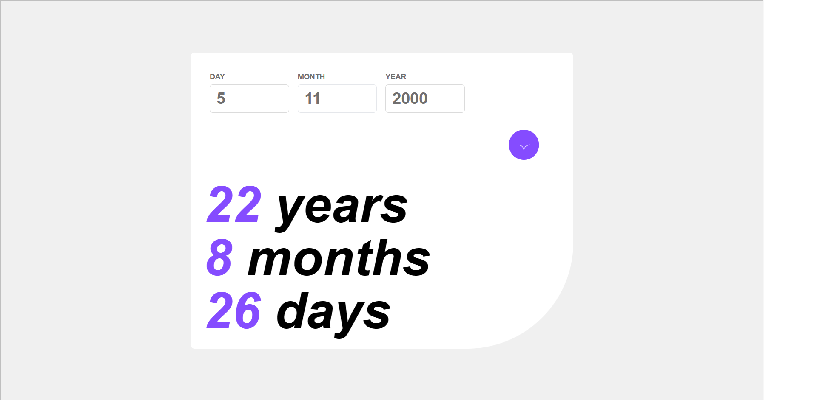

# frontendmentor-agecalculator
# Frontend Mentor - Age calculator app solution-0987t6re4f2wd1qdfxgcv/
'gfdsaZ
KJGF CXZ \/=-09iu8lfxdcgtyuiop[-==-098t6re4w3q2qwerp[]\]
This is a solution to the [Age calculator app challenge on Frontend Mentor](https://www.frontendmentor.io/challenges/age-calculator-app-dF9DFFpj-Q). Frontend Mentor challenges help you improve your coding skills by building realistic projects. 

## Table of contents

- [Overview](#overview)
  - [The challenge](#the-challenge)
  - [Screenshot](#screenshot)
  - [Links](#links)
- [My process](#my-process)
  - [Built with](#built-with)
  - [What I learned](#what-i-learned)
  - [Continued development](#continued-development)
  - [Useful resources](#useful-resources)
- [Author](#author)
- [Acknowledgments](#acknowledgments)


## Overview

### The challenge

Users should be able to:

- View an age in years, months, and days after submitting a valid date through the form
- Receive validation errors if:
  - Any field is empty when the form is submitted
  - The day number is not between 1-31
  - The month number is not between 1-12
  - The year is in the future
  - The date is invalid e.g. 31/04/1991 (there are 30 days in April)
- View the optimal layout for the interface depending on their device's screen size
- See hover and focus states for all interactive elements on the page
- **Bonus**: See the age numbers animate to their final number when the form is submitted

### Screenshot



### Links

- Solution URL: (https://www.frontendmentor.io/challenges/age-calculator-app-dF9DFFpj-Q/solutions/new))
- Live Site URL: (https://www.frontendmentor.io/challenges/age-calculator-app-dF9DFFpj-Q/solutions/new)

## My process

### Built with

- Semantic HTML5 markup
- CSS custom properties
- Flexbox

- Mobile-first workflow
- [React](https://reactjs.org/) - JS library

- [tailwindcss]([(https://tailwindcss.com/)] - For styles


### What I learned

from this project i learn a lot about css framework tailwindcss. i learn how to add custom css class to add  tailwind and also i learn how to work with dates in javascript


```
```
```js
const proudOfThisFunc = () => {

    return new Date(year, month, 0).getDate()
  
}
```

### Continued development

i want to know more about  tailwindcss and  react

### Useful resources

- [MDN web docs]([(https://developer.mozilla.org/))] - This helped me for date reason. I really liked this pattern and will use it going forward.

## Author


- Frontend Mentor - [@abela2112](https://www.frontendmentor.io/profile/abela2112)


## Acknowledgments

I really want to thanks for frontend mentor who prepare this project it really helps developers specially those who are like me.i want to say thank you
